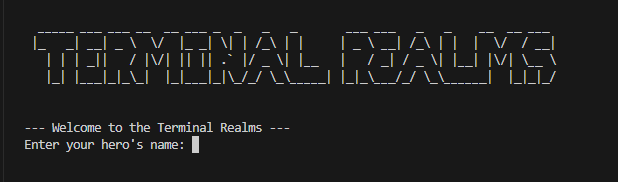
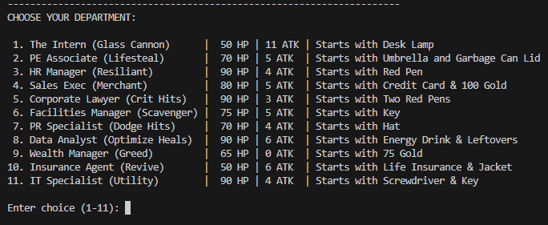
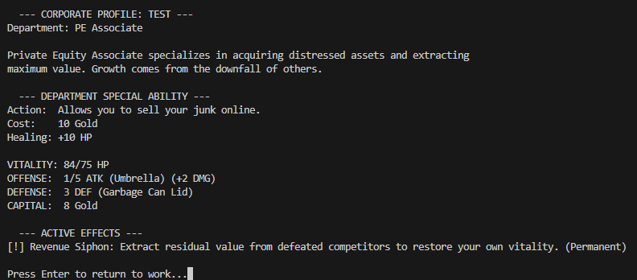
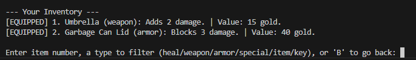
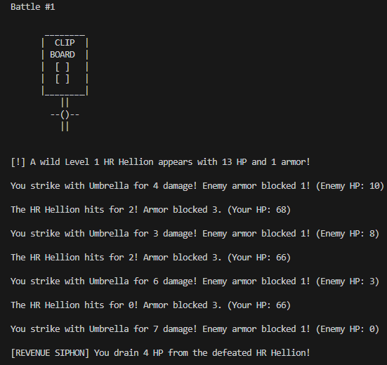
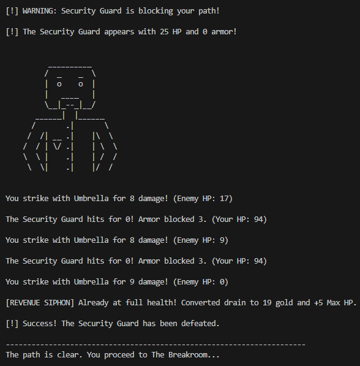

# Terminal Realms

Corporate fantasy ASCII RPG built in Python.

Fight your way through a cursed office building filled with:
- Spreadsheet Spirits
- Meeting Minotaurs
- Corporate Vampires
- HR Hellions
- and more...

## Features

- Multiple departments/classes
- Boss fights
- Inventory system
- Looting
- Status effects
- ASCII art enemies
- Gold & vendors
- Replayable builds

## Classes

- Intern
- PE Associate
- HR Manager
- Sales Exec
- Corporate Lawyer
- Facilities Manager
- PR Specialist
- Data Analyst
- Wealth Manager
- Insurance Agent
- IT Specialist

or type 'random' if there are too many choices.

## Run the Game

python main.py

## Future Plans

- Procedural rooms
- Expanded bosses
- More events
- Pygame graphical version
- Difficulty modes

## Screenshots
Title Screen:

Department Choice:

Stats Screen:

Inventory Screen:

Battle:

Boss Fight:

